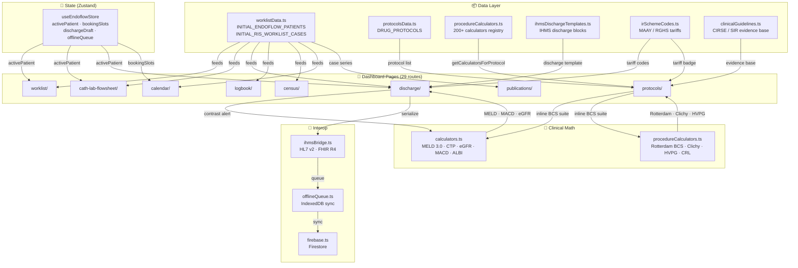

# Vascule OS — Codebase Knowledge Graph

> **Pre-Task Reading Protocol** (see `.agents/rules/graphify-first.md`):
> Before any coding task, read this file and run `graphify query "<affected-area>"` to understand data flows.
> Generated: 2026-09-23 | Graphify run: `graphify-out/GRAPH_REPORT.md` (342 nodes · 709 edges)

---

## 1. Monorepo Topology

```
c:\SSO/                                         ← workspace root
├── apps/
│   └── web-app/                                ← Next.js 16.3 (App Router + Turbopack)
│       └── app/
│           ├── page.tsx                        ← Launchpad / login shell
│           ├── layout.tsx                      ← Root layout (providers, fonts)
│           ├── providers.tsx                   ← QueryClientProvider, AuthProvider
│           ├── dashboard/                      ← Protected clinical suite (29 sub-routes)
│           │   ├── layout.tsx                  ← Shell: GoogleHeader + GoogleSidebar
│           │   ├── page.tsx                    ← Main dashboard / home
│           │   ├── worklist/                   ← RIS worklist (INITIAL_RIS_WORKLIST_CASES)
│           │   ├── cath-lab-flowsheet/         ← Live Angio flowsheet
│           │   ├── consent/                    ← Bilingual consent studio
│           │   ├── operative-notes/            ← Op-notes generator
│           │   ├── discharge/                  ← IHMS discharge studio
│           │   ├── logbook/                    ← Procedure logbook
│           │   ├── protocols/                  ← Drug + clinical protocols (9 BCS calcs)
│           │   ├── calculators/                ← Standalone calculator runner
│           │   ├── census/                     ← Patient census / analytics
│           │   ├── calendar/                   ← OT + OPD scheduling (holiday-aware)
│           │   ├── imaging/                    ← DICOM viewer (Cornerstone3D)
│           │   ├── hardware/                   ← Hardware catalog
│           │   ├── inventory/                  ← Inventory management
│           │   ├── schemes/                    ← MAAY / RGHS scheme tariff viewer
│           │   ├── publications/               ← Research paper tracker
│           │   ├── pipeline/                   ← Data pipeline view
│           │   ├── ai-copilot/                 ← Gemini AI assistant
│           │   ├── report/                     ← Report generation
│           │   ├── reports/                    ← Reports browser
│           │   ├── logistics/                  ← Logistics tracker
│           │   ├── op-clinic/                  ← OPD clinic
│           │   ├── doppler/                    ← Doppler reporting
│           │   ├── simulations/                ← Clinical simulations
│           │   ├── analytics/                  → redirects to /census
│           │   ├── bed-board/                  ← Bed management
│           │   └── catalog/                    ← Procedure catalog browser
│           ├── components/                     ← Shared UI components
│           │   ├── shell/                      ← GoogleHeader, GoogleSidebar
│           │   └── calculators/                ← ProcedureCalculatorRunner
│           ├── lib/                            ← All business logic
│           │   ├── calculators.ts              ← Core clinical math (MELD, eGFR, MACD…)
│           │   ├── procedureCalculators.ts     ← 200+ IR procedure calculators registry
│           │   ├── procedureClassificationRegistry.ts  ← 798 KB classification master
│           │   ├── data/
│           │   │   ├── protocolsData.ts        ← DRUG_PROTOCOLS (137 KB, all protocols)
│           │   │   ├── clinicalGuidelines.ts   ← CLINICAL_GUIDELINES (68 KB)
│           │   │   ├── procedureWorkupTemplates.ts ← Pre-procedure workup checklists
│           │   │   ├── protocolYojanaMapping.ts ← Protocol → MAAY/RGHS scheme mapping
│           │   │   └── procedures/             ← Per-specialty procedure data files
│           │   ├── realData/                   ← Real SMS patient data
│           │   │   └── worklistData.ts         ← INITIAL_ENDOFLOW_PATIENTS, INITIAL_RIS_WORKLIST_CASES
│           │   ├── ihmsBridge.ts               ← HL7 v2 / FHIR R4 message builders
│           │   ├── irSchemeCodes.ts            ← MAAY / RGHS procedure tariff codes
│           │   ├── staffAccounts.ts            ← Staff roles & permissions
│           │   ├── dicomUtils.ts               ← DICOM tag parsing & window utilities
│           │   ├── censusEngine.ts             ← Analytics aggregation engine
│           │   ├── risParser.ts                ← RIS worklist parser
│           │   ├── offlineQueue.ts             ← IndexedDB offline queue
│           │   └── firebase.ts                 ← Firebase/Firestore client
│           └── types/                          ← Shared TypeScript interfaces
├── packages/
│   ├── catalog/                                ← Shared procedure catalog package
│   ├── db/                                     ← Prisma ORM schema
│   ├── features/
│   │   ├── dicom-viewer/                       ← Cornerstone3D wrapper
│   │   └── scheme-billing/                     ← MAAY billing integration
│   ├── ui-kit/                                 ← Shared Radix/Shadcn components
│   └── utils/                                  ← Shared utility functions
├── services/                                   ← Golang microservices (planned)
├── prisma/                                     ← Database schema
├── graphify-out/                               ← Knowledge graph output (342 nodes)
│   ├── graph.json                              ← Full graph data
│   ├── graph.html                              ← Interactive visual explorer
│   └── GRAPH_REPORT.md                         ← Auto-generated graph report
├── .agents/
│   ├── hooks.json                              ← PostToolUse hooks (TSC typecheck)
│   └── rules/
│       ├── performance.md                      ← 60fps / Zustand selector rules
│       └── graphify-first.md                   ← [NEW] Pre-task graphify protocol
├── rules.md                                    ← Enterprise architecture laws
└── KNOWLEDGE_GRAPH.md                          ← [THIS FILE]
```

---

## 2. God Nodes (Core Abstractions — Touch Carefully)

| Rank | Symbol | Edges | Role |
|------|--------|-------|------|
| 1 | `cn()` | 59 | Tailwind class merger — used in every component |
| 2 | `useClinicalStore` / `useEndoflowStore` | 36 | Global Zustand state — patient, tab, drawer, modal state |
| 3 | `calculateMacd()` | 15 | Cigarroa contrast ceiling — called from discharge, flowsheet, calculators |
| 4 | `calculateEgfrCkdEpi2021()` | 9 | eGFR — drives contrast safety & nephro flags |
| 5 | `isHolidayOrSunday()` | 9 | Holiday matrix — drives OT scheduling conflict engine |
| 6 | `CalculatorsPage()` | 9 | Standalone calculator hub |
| 7 | `DischargeStudioPage()` | 8 | IHMS discharge generator — calls 6+ calculators |
| 8 | `StaffRoleCode` | 8 | Role-based access enum — gates all admin actions |
| 9 | `PatientSafetyProfile` | 8 | Cross-page patient safety flags (allergy, CKD, contrast) |
| 10 | `OTCalendar()` | 7 | Holiday-aware scheduling grid |

> **Rule**: Never modify these without reading all 8-59 dependent files first.
> Run: `graphify path "calculateMacd" "DischargeStudioPage"` before editing `calculators.ts`.

---

## 3. Patient Data Flow

```
INITIAL_ENDOFLOW_PATIENTS (worklistData.ts)
    │
    ├──► worklist/page.tsx          RIS Worklist — list + status update
    ├──► cath-lab-flowsheet/        Live Angio suite flowsheet
    ├──► consent/                   Bilingual consent studio (Hindi + English)
    ├──► operative-notes/           Op-notes PDF generator
    ├──► discharge/                 IHMS discharge studio
    │       └── ihmsDischargeTemplates.ts
    │               ├── SUNIL_KUMAR_DISCHARGE     (VenaSeal varicose)
    │               ├── BUDD_CHIARI_DISCHARGE     (BCS TIPS)
    │               └── ANJUM_NISHA_DISCHARGE     (alias of BUDD_CHIARI)
    ├──► logbook/                   Procedure logbook aggregator
    ├──► census/                    censusEngine.ts — analytics + KPI cards
    ├──► calendar/                  OT booking (RAJASTHAN_HOLIDAYS_2026)
    ├──► report/                    Report generation
    └──► pipeline/                  Research data pipeline

INITIAL_RIS_WORKLIST_CASES (worklistData.ts)
    └──► worklist/page.tsx          Secondary RIS modality worklist
```

---

## 4. Protocol → Calculator Linkage

```
protocolsData.ts  →  DRUG_PROTOCOLS[]
    │
    ├── id: "bcs"  ──────────────────────────────────────────────────────┐
    │                                                                    │
    │   protocols/page.tsx (inline 9-calculator BCS suite)              │
    │       ├── calculateRotterdamBcs()      procedureCalculators.ts:67  │
    │       ├── calculateClichyScore()       procedureCalculators.ts:138 │
    │       ├── calculateCaudateRightLobeRatio() ::197                   │
    │       ├── calculateHvpg()              ::334                       │
    │       ├── calculateBuddChiariCompositeRisk() ::3488                │
    │       ├── calculateMeld3()             calculators.ts:326          │
    │       ├── calculateChildPugh()         calculators.ts:215          │
    │       ├── calculateAlbi()              calculators.ts:285          │
    │       └── calculateMacd()             calculators.ts:36           │
    │                                                                    │
    ├── id: "tace"                                                       │
    │   └── protocols/page.tsx → Child-Pugh + MACD inline calcs         │
    │                                                                    │
    ├── id: "pad_angioplasty"                                            │
    │   └── protocols/page.tsx → Rutherford + ABI inline calcs          │
    │                                                                    │
    └── all others                                                       │
        └── ProcedureCalculatorRunner (components/calculators/)         │
                └── getCalculatorsForProtocol(protocolId)               │
                        └── PROCEDURE_CALCULATORS registry              │
                                (procedureCalculators.ts:3543)          │
                                200+ calculators, each with:            │
                                ├── id, name, category                  │
                                ├── inputs[]                            │
                                ├── calculate() fn                      │
                                └── protocolIds[]  ───────────────────┘
```

---

## 5. Scheme / Tariff Data Flow

```
irSchemeCodes.ts
    └── IR_PROCEDURES[]
            ├── code (MAAY/RGHS package code)
            ├── name (procedure name)
            ├── tariff (₹ amount)
            └── protocolId → links to DRUG_PROTOCOLS

protocolYojanaMapping.ts
    └── PROTOCOL_YOJANA_MAP{}
            └── maps protocolId → { maayCode, rghsCode, tariff }

schemes/page.tsx
    └── renders tariff cards + eligibility checks

irSchemeCodes.ts ──► ihmsBridge.ts
    └── bookingSlotToFhirServiceRequest()
    └── bookingSlotToHl7OrmO01()
    └── dischargeToFhirDiagnosticReport()
    └── dischargeToHl7OruR01()
```

---

## 6. Component Hierarchy

```
app/layout.tsx  (root)
  └── providers.tsx  (QueryClient + Auth)
      └── dashboard/layout.tsx  (protected shell)
            ├── GoogleHeader.tsx    ← "Book/Admit" → /dashboard/calendar?action=new
            ├── GoogleSidebar.tsx   ← Navigation links (no duplicate buttons)
            └── [page]             ← Route-specific page component
                    │
                    ├── protocols/page.tsx
                    │       ├── Organ System Dropdown
                    │       ├── Protocol Dropdown (grouped by <optgroup>)
                    │       ├── Prev/Next stepper
                    │       ├── Live Tariff badge
                    │       └── [BCS] → 9 inline calculator input cards
                    │
                    ├── discharge/page.tsx  (DischargeStudioPage)
                    │       ├── calculateMacd() — contrast ceiling alert
                    │       ├── calculateEgfrCkdEpi2021() — renal flag
                    │       ├── ihmsDischargeTemplates.ts — IHMS block export
                    │       └── ihmsBridge.ts — HL7/FHIR message
                    │
                    └── calculators/page.tsx  (CalculatorsPage)
                            └── ProcedureCalculatorRunner
                                    └── PROCEDURE_CALCULATORS.find(id)
                                            └── calculator.calculate(inputs)
```

---

## 7. State Management

```
useEndoflowStore (dashboard/useEndoflowStore.ts)  ← 42 KB Zustand store
    ├── activePatient         → PatientRecord (current worklist selection)
    ├── activeTab             → string (current dashboard tab)
    ├── drawerOpen            → boolean
    ├── selectedProcedure     → ProcedureRecord
    ├── bookingSlots[]        → OT calendar slots
    ├── consentSigned         → boolean
    ├── dischargeDraft        → DischargeFormData
    └── offlineQueue[]        → offlineQueue.ts (IndexedDB sync)

Rule: Always use atomic selectors:
    const patient = useEndoflowStore(s => s.activePatient)  ✅
    const store = useEndoflowStore()                         ❌
```

---

## 8. Research Paper Data Pipeline

```
papers/                         ← Research paper directory
    └── [paper-name]/
            ├── data/           ← Raw Excel / CSV patient data
            ├── analysis/       ← Statistical analysis scripts
            └── draft/          ← JVIR/CVIR-formatted Word drafts

publications/page.tsx           ← Paper tracker (6 active papers)
    ├── Paper 1: Visceral Artery Pseudoaneurysm (VAP)
    ├── Paper 2: Budd-Chiari Syndrome TIPS outcomes
    ├── Paper 3: Portal Hypertension — BRTO/BATO series
    ├── Paper 4: PAD Endovascular outcomes
    ├── Paper 5: Hepatocellular Carcinoma TACE/TARE
    └── Paper 6: Varicose Vein Endovenous series

SMS_Jaipur_IR_Master_Analysis.xlsx  ← Master patient dataset
    └── build_sms_ir_master_sheet.py ← Data ingestion script
            └── import pymupdf       (use `import pymupdf` not `fitz`)
```

---

## 9. DICOM / Imaging Stack

```
dicomUtils.ts
    ├── DICOM_TAGS{}                    ← Standard DICOM tag dictionary
    ├── DICOM_WINDOW_PRESETS{}          ← CT window level presets
    ├── buildQidoSearchUrl()            ← DICOMweb QIDO-RS query builder
    ├── buildWadoRsUrl()                ← DICOMweb WADO-RS retrieval URL
    ├── calculateHounsfieldUnits()      ← HU pixel value computation
    └── computeWindowedPixel()          ← Window/level pixel normalization

packages/features/dicom-viewer/         ← Cornerstone3D wrapper package
    └── imaging/page.tsx               ← DICOM viewer page (lazy-loaded)
```

---

## 10. Architecture Diagram



---

## 11. Key File Cross-Reference

| File | Size | What It Does | Depends On |
|------|------|-------------|------------|
| `procedureCalculators.ts` | 204 KB | 200+ IR calculator definitions | — |
| `procedureClassificationRegistry.ts` | 798 KB | Full ICD-10/IR procedure classification | — |
| `protocolsData.ts` | 137 KB | All drug + clinical protocols | `irSchemeCodes.ts` |
| `clinicalGuidelines.ts` | 68 KB | CIRSE/SIR evidence-based guidelines | — |
| `useEndoflowStore.ts` | 42 KB | Global Zustand state store | `worklistData.ts` |
| `offlineQueue.ts` | 25 KB | IndexedDB offline sync queue | `ihmsBridge.ts` |
| `censusEngine.ts` | 28 KB | Analytics aggregation | `worklistData.ts` |
| `calculators.ts` | 20 KB | Core clinical math functions | — |
| `staffAccounts.ts` | 13 KB | Role-based access control | — |
| `dicomUtils.ts` | 15 KB | DICOM tag & window utilities | — |
| `irSchemeCodes.ts` | 15 KB | MAAY/RGHS tariff codes | — |
| `ihmsBridge.ts` | 9 KB | HL7 v2 / FHIR R4 builders | `irSchemeCodes.ts` |

---

## 12. Agent Skill Protocol Reference

Per `rules.md` Section 2 (Mandatory Subagent Orchestration):

| Agent Skill | Trigger | What It Does |
|-------------|---------|-------------|
| **graphify-windows** | Before architecture changes | Generates/queries `graphify-out/graph.json` — surfaces god nodes, dependencies |
| **ponytail** | Every coding task | Senior-developer discipline: minimal diff · reuse before create · zero boilerplate · single-pass correctness · token-efficient tool use |
| **Karpathy (rules.md §1)** | Always | Think-before-coding · Simplicity-first · Surgical precision · Zero placeholders · Verify |
| **aris-mermaid-diagram** | Diagram generation | Saves `.mmd` + `.md` to `figures/` with syntax verification |

---

## 13. Common Code Paths (Quick Lookup)

| Task | File(s) to Read | Key Function |
|------|----------------|-------------|
| Add a new calculator | `procedureCalculators.ts:3543` | Add to `PROCEDURE_CALCULATORS` array |
| Add protocol BCS calc | `protocols/page.tsx` | Add input state + result card |
| Add patient to worklist | `realData/worklistData.ts` | Add to `INITIAL_ENDOFLOW_PATIENTS` |
| Add discharge template | `discharge/ihmsDischargeTemplates.ts` | Add named export + `generateSmsDischargeSummary` case |
| Add MAAY tariff | `irSchemeCodes.ts` | Add to `IR_PROCEDURES` array |
| Add drug protocol | `lib/data/protocolsData.ts` | Add to `DRUG_PROTOCOLS` array |
| Add clinical guideline | `lib/data/clinicalGuidelines.ts` | Add to `CLINICAL_GUIDELINES` array |
| Add research paper | `dashboard/publications/` | Update paper tracker page |
| New dashboard page | `dashboard/[name]/page.tsx` | Add route + sidebar link in `GoogleSidebar.tsx` |
| Performance fix | `.agents/rules/performance.md` | Atomic Zustand selector + `useMemo` |

---

## 14. Verification Gates

Before declaring any task complete, run all three gates:

```powershell
# Gate 1: TypeScript typecheck
npx tsc --noEmit

# Gate 2: Unit tests (Vitest — 16 suites, 150 tests)
npm test

# Gate 3: Production build
npm run build --prefix apps/web-app
```

Expected: `0 errors · 150/150 tests pass · 38/38 routes compiled`

---

*Updated by Antigravity agent. To refresh the graphify analysis: run `graphify` from `c:\SSO` root.*
