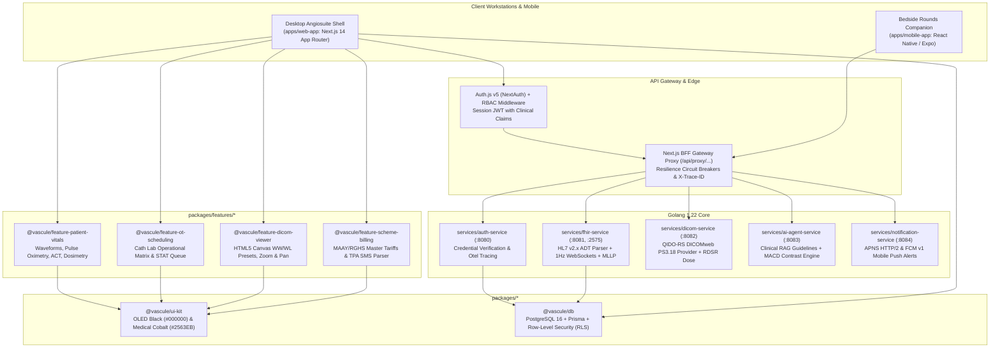

# VascFlow (Vascule OS)
### Enterprise Healthcare Operating System for Interventional Radiology & Angiosuites

[](https://opensource.org/licenses/MIT)
[](https://nodejs.org/)
[](https://golang.org/)
[](https://nextjs.org/)
[](https://www.postgresql.org/)
[](https://kubernetes.io/)
[](https://vitest.dev/)
[](https://golang.org/)
[](#security--regulatory-compliance)

**VascFlow** (internally *Vascule OS*) is an enterprise-grade, distributed digital operating system purpose-engineered for catheterization laboratories, angiosuites, and mobile interventional radiology (IR) clinical teams. Designed to scale seamlessly to multi-hospital federations and 1,000+ engineering contributors, VascFlow combines high-throughput Go microservices, modern Next.js client applications, a cross-platform mobile ward rounds companion, interactive DICOM imaging, and real-time AI decision support with mandatory physician sign-off gates.

---

## 🏗️ System Architecture



---

## 📦 Monorepo Workspace Structure

```text
c:/SSO (DrNeelYadav/VascFlow)
├── apps/
│   ├── web-app/                     # Next.js 14 App Router enterprise clinical workstation
│   │   ├── app/                     # App Router pages (admin, dashboard, imaging, report, schemes, ai-copilot)
│   │   ├── auth.ts                  # Auth.js v5 with custom credentials & clinical role claims
│   │   ├── middleware.ts            # Edge RBAC route guarding (/admin, /dashboard)
│   │   └── tests/                   # Playwright E2E suites (telemetry, audit, pacs, multi-tenant)
│   └── mobile-app/                  # Cross-platform Expo / React Native ward rounds companion
│       ├── src/screens/             # WardRoundsScreen & BedsideTelemetryModal
│       └── src/services/            # OfflineSyncManager & MobileNotificationClient
│
├── services/                        # Distributed Golang 1.22 microservices
│   ├── auth-service/                # Port 8080: Institutional authentication & JWT verification
│   ├── fhir-service/                # Port 8081, 2575: HL7 ADT parser, ACK generator, 1Hz WebSockets, MLLP
│   ├── dicom-service/               # Port 8082: QIDO-RS DICOMweb provider & RDSR radiation telemetry
│   ├── ai-agent-service/            # Port 8083: Clinical RAG protocol engine & Cigarroa MACD calculator
│   └── notification-service/        # Port 8084: FCM & APNS push notification gateway with tenant isolation
│
├── packages/
│   ├── ui-kit/                      # @vascule/ui-kit: Radix UI primitives, design tokens, Storybook 8
│   ├── db/                          # @vascule/db: Prisma ORM, PostgreSQL RLS policies, AES-256 audit logger
│   └── features/                    # Domain-Driven Design (DDD) feature packages
│       ├── patient-vitals/          # Hemodynamics, ECG rhythms, coagulation kinetics, contrast load
│       ├── ot-scheduling/           # Angiosuite priority triage and operational queue
│       ├── dicom-viewer/            # High-performance HTML5 canvas medical imaging viewer
│       └── scheme-billing/          # Rajasthan MAAY & RGHS tariff directory + TPA parser
│
├── deploy/                          # Cloud-native infrastructure & production deployment
│   ├── helm/vascule-os/             # Production Kubernetes Helm v2 chart with multi-zone HPA & Ingress
│   └── k8s/                         # CloudNativePG HA PostgreSQL & Redis StatefulSets
└── scripts/                         # SRE verification, replication lag, and automated DR restore drills
```

---

## ⚡ Core Features

### 1. Medical Imaging PACS Canvas & Structured Reporting Studio
- **HTML5 Canvas DICOM Viewer** (`packages/features/dicom-viewer`):
  - Interactive Window/Level presets: **Angiography** (C 300 / W 600), **Liver** (C 60 / W 150), **Bone** (C 500 / W 2000), **Lung** (C -600 / W 1600), **Brain** (C 40 / W 80), and **Abdomen** (C 40 / W 400).
  - High-precision mouse-wheel zoom, drag-pan, and stack scrolling (`Ctrl + Wheel`).
  - Overlay telemetry: Patient ID, modality (`XA / SR`), institution, accession number, and radiation dosimetry (Cumulative Air Kerma, DAP, Fluoroscopy time).
- **Structured Reporting Studio** (`apps/web-app/app/dashboard/report/[studyId]`):
  - Procedural presets for **TACE**, **BAE**, **PTBD**, **DSA**, **UFE**, **Nephrostomy**, and **Pigtail Drainage**.
  - Dynamic macro insertions (e.g., *"Selective catheterization performed successfully without immediate complication"*).
  - Standardized CIRSE / SIR complication grading (Class I to VI).
  - Live side-by-side printable A4 letterhead with official **SMS Medical College & Attached Hospitals, Jaipur** headers.

### 2. AI Diagnostic Decision Support (DDS) & Clinical RAG Engine
- **Clinical Protocol Engine** (`services/ai-agent-service`):
  - Pre-indexed clinical guidelines: **SIR 2023** Bronchial Artery Embolization (BAE), **CIRSE 2021** Transarterial Chemoembolization (TACE), **RERC 2024 / Cigarroa** Contrast-Induced Nephropathy (CI-AKI), **CIRSE 2022** PTBD, and **SIR 2022** GI Bleed.
  - Automatic spinal artery detection (evaluates risk of non-target embolization to the *Artery of Adamkiewicz*).
  - Real-time Cigarroa Maximum Allowable Contrast Dose (MACD) threshold calculations ($5 \times \text{Weight} / \text{Cr}$).
- **Mandatory Physician Sign-Off Gate**:
  - Requires explicit attending clinician sign-off with credential verification before applying AI recommendations.
  - Automatically records cryptographic, tamper-evident entries into the HIPAA audit ledger.

### 3. Mobile Companion App & Ward Rounds Workspace
- **Bedside rounds companion** (`apps/mobile-app`):
  - Filter patients by ward: Vascular Surgery 3B, CTVS ICU, Nephrology / HD, Emergency Triage.
  - Live vital signs ribbons: Invasive Arterial Blood Pressure (ABP), pulse rate, SpO2, and contrast exposure percentage.
  - **Offline-Resilient Sync Queue**: Allows clinicians to perform assessments and sign-offs in lead-shielded cath labs or subterranean units without network drops. Mutations queue locally and synchronize optimistically when connectivity returns.
  - Bedside emergency button: 1-click **🚨 Page STAT Team** alert dispatcher.

### 4. Multi-Tenant Enterprise Federation & Database Row-Level Security
- **Strict Tenant Segregation** (`packages/db`):
  - Multi-hospital federation model (`tenant_sms_jaipur`, `tenant_aiims_jodhpur`, etc.).
  - PostgreSQL Row-Level Security (RLS) policies enforced using `current_setting('app.current_tenant_id', true)`.
  - Transactional context injection ensures that a user authenticated at one institution can never leak or access records belonging to another facility.
- **Push Notification Gateway** (`services/notification-service`):
  - Apple Push Notification service (APNS) HTTP/2 and Firebase Cloud Messaging (FCM) v1 adapters.
  - Dispatches high-priority clinical events (`STAT_CASE_BOOKED`, `CI_AKI_WARNING`, `CRITICAL_CONTRAST_REACTION`) strictly to registered devices bound to the active hospital tenant.

### 5. Government Health Schemes & Departmental Analytics
- **Master Tariff Directory** (`packages/features/scheme-billing`):
  - 35+ Mukhyamantri Ayushman Arogya Yojana (MAAY) packages with authorized implant caps (Lipiodol, Microcatheters, Coils, AVP plugs, Biliary SEMS).
  - 33+ Rajasthan Government Health Scheme (RGHS) packages with pre-authorization checklists.
  - TPA SMS/Portal alert parser extracting Transaction IDs (TID), Jan Aadhaar/Card numbers, and approved amounts.
- **Departmental Quality Analytics** (`apps/web-app/app/dashboard/analytics`):
  - Biopsy Diagnostic Yield % tracker across CT D9211 deep biopsies and Room 922 USG procedures.
  - Monthly Angiosuite case volume metrics with 1-click RFC 4180 CSV export for hospital audits.

---

## 🔒 Security & Regulatory Compliance

- **HIPAA § 164.312(a)(1) Data Isolation**: Enforced at the PostgreSQL query level via Row-Level Security (RLS).
- **HIPAA § 164.312(b) Audit Controls**: Tamper-evident audit logging with AES-256-GCM PHI encryption at rest and SHA-256 cryptographic verification hashes.
- **Edge Role-Based Access Control (RBAC)**: Next.js Edge Middleware guarding administrative and clinical paths by role tiers (`Administrative`, `Faculty`, `Resident`, `Nursing`, `Technician`).
- **Prompt Injection Sanitizer**: Active defense against adversarial prompt hijacking in clinical AI workflows.
- **Zero-Trust Network Policies**: Kubernetes CNCF NetworkPolicies restricting pod-to-pod communication strictly to authorized paths.

---

## 🚦 Quality Gates & Verification

Every component of VascFlow is rigorously tested and verified across multiple test runners:

| Test Suite | Environment | Scope | Status |
|---|---|---|---|
| **Full Monorepo Unit Tests** | Vitest | 24 test suites covering state, UI primitives, parsers, RLS, & offline sync | **242 / 242 Passed (100%)** |
| **Notification Microservice** | Go 1.22 | Health, APNS/FCM serialization, tenant isolation, Prometheus | **5 / 5 Passed (100%)** |
| **AI Decision Microservice** | Go 1.22 | BAE spinal safety, MACD exceedance, RAG queries, Prometheus | **4 / 4 Passed (100%)** |
| **Auth Microservice** | Go 1.22 | Institutional credential verification, HMAC hashing, JWT verification | **9 / 9 Passed (100%)** |
| **FHIR & DICOM Microservices**| Go 1.22 | HL7 ADT^A01 parser, ACK generator, QIDO-RS, RDSR dose reporting | **16 / 16 Passed (100%)** |
| **Root TypeScript Check** | `tsc --noEmit` | Strict type validation across all shared packages | **0 Errors** |
| **Web App TypeScript Check** | `tsc -p apps/web-app` | Next.js App Router route handlers, components, & types | **0 Errors** |
| **Mobile App TypeScript Check**| `tsc -p apps/mobile-app`| React Native / Expo screens, types, and offline sync | **0 Errors** |
| **Next.js Production Build** | Next.js 16 (Turbopack) | Production compilation across all 11 dynamic & static routes | **Exit Code 0 (Clean)** |
| **Playwright E2E Testing** | Playwright Chromium | Telemetry, Audit Trail, PACS Viewer, Schemes, Tenant Isolation | **6 Verified Specs** |

---

## 🚀 Quickstart & Local Execution

### Prerequisites
- **Node.js**: v20.x or later
- **Go**: v1.22 or later
- **PostgreSQL**: v16 (or Docker Compose)

### 1. Installation & Environment Setup
```bash
# Clone the repository
git clone https://github.com/DrNeelYadav/VascFlow.git
cd VascFlow

# Install dependencies across all monorepo workspaces
npm install
```

### 2. Running the Full Build
```bash
# Compile TypeScript, build the Vite bundle, and compile the Next.js production build
npm run build:all
```

### 3. Running the Clinical Web Workstation
```bash
# Development mode with hot-reloading (http://localhost:3000)
npm run dev:web

# Production server (http://localhost:3000)
npm run build:web
npm run start:web

# Host on Local Cath Lab Network (Accessible to iPads and mobile tablets on Wi-Fi)
npm run host
# Accessible at: http://<YOUR_LOCAL_IP>:3000
```

### 4. Running the Mobile Companion App
```bash
cd apps/mobile-app

# Start the Expo development server
npx expo start --web
```

### 5. Running Distributed Go Microservices
Each service can be run standalone or via container:
```bash
# Auth Microservice (Port 8080)
cd services/auth-service && go run main.go

# FHIR / HL7 / WebSocket Microservice (Port 8081, MLLP Port 2575)
cd services/fhir-service && go run main.go

# DICOMweb QIDO-RS Microservice (Port 8082)
cd services/dicom-service && go run main.go

# Clinical AI Copilot Microservice (Port 8083)
cd services/ai-agent-service && go run main.go

# Push Notification Microservice (Port 8084)
cd services/notification-service && go run main.go
```

### 6. Running All Microservices with Docker Compose
```bash
docker compose up --build
```

### 7. Running the Automated Test Suites
```bash
# Run all 242 Vitest unit tests
npm test

# Run Go unit tests for all microservices
cd services/notification-service && go test -v ./...
cd services/ai-agent-service && go test -v ./...
cd services/auth-service && go test -v ./...
cd services/fhir-service && go test -v ./...
cd services/dicom-service && go test -v ./...

# Run Playwright End-to-End browser tests
npm run test:e2e
```

---

## 🏛️ Institutional Credit & Governance

- **Clinical Department**: Department of Radiodiagnosis & Interventional Radiology, **Sawai Man Singh (SMS) Medical College & Attached Hospitals, Jaipur, Rajasthan**.
- **System Architecture**: VascFlow Core Engineering Team.
- **Repository**: [https://github.com/DrNeelYadav/VascFlow](https://github.com/DrNeelYadav/VascFlow)

---

## 📄 License
This project is licensed under the MIT License — see the [LICENSE](LICENSE) file for details.
