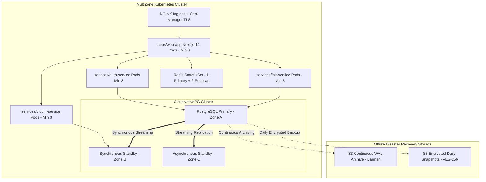

# Vascule OS Disaster Recovery (DR) & Business Continuity Runbook

## Document Control
- **Document Version:** 1.0.0
- **Classification:** Confidential — Healthcare Infrastructure Standard
- **Compliance Scope:** HIPAA Security Rule (§ 164.308(a)(7)), SOC 2 Type II (Availability & Confidentiality), ISO 27001
- **Target Organization:** SMS Medical College & Attached Hospitals, Jaipur
- **Primary Facility:** Interventional Radiology & Angio Suites

---

## 1. Executive Summary & Recovery Objectives

Vascule OS is a mission-critical clinical operating system orchestrating intra-operative hemodynamics, DICOM imaging, and government health scheme authorizations (MAAY/RGHS). Interruption to system availability during acute interventions (e.g., Bronchial Artery Embolization for massive hemoptysis) can result in catastrophic clinical outcomes.

### Service Level Objectives (SLAs)
| Metric | SLA Target | Actual Architecture Capability | Verification Mechanism |
|---|---|---|---|
| **Recovery Point Objective (RPO)** | **< 5 minutes** | **0 seconds** (Synchronous streaming replication with `minSyncReplicas: 1`) | Continuous WAL streaming + replication lag probes |
| **Recovery Time Objective (RTO)** | **< 15 minutes** | **< 30 seconds** for automated node failover; **< 6 minutes** for full cold restore | Automated CNPG election + ephemeral restore drill script |
| **Data Durability** | **99.999999999% (11 9s)** | Multi-AZ CloudNativePG + Cross-Region S3 Object Storage with AES-256 | SHA-256 daily checksums |

---

## 2. High-Availability Architecture Overview



---

## 3. Threat Scenarios & Classification

| Severity | Incident Scenario | Primary Trigger | Recovery Path |
|---|---|---|---|
| **Sev-0** | Total Multi-Zone Datacenter Outage | Cloud provider regional failure or power grid blackout | Promote Secondary Region standby via cross-region backup restoration |
| **Sev-1** | Primary Database Node Failure | Hardware panic, node termination, disk exhaustion | Automated CloudNativePG failover to synchronous replica (< 30s) |
| **Sev-2** | Split-Brain or Network Partition | Inter-zone network degradation | Quorum fencing auto-demotes isolated node; connection pooler reroutes |
| **Sev-3** | Logical Data Corruption / Human Error | Accidental record deletion or bad migration | Point-In-Time-Recovery (PITR) using Barman WAL logs |

---

## 4. Operational Recovery Procedures

### Scenario A: Automated Failover (Primary Node Crash)
*CloudNativePG automatically promotes the synchronous replica when the primary fails health checks.*

1. **Verify Cluster Health:**
   ```bash
   kubectl cnpg status vascule-pg-cluster -n default
   ```
2. **Observe Automatic Promotion:**
   The synchronous standby (e.g. `vascule-pg-cluster-2`) is promoted to Primary. `vascule-pg-pooler-rw` immediately routes all application write traffic to the new primary without configuration changes.
3. **Verify Read-Write Operations:**
   ```bash
   kubectl run test-query --rm -it --image=postgres:16-alpine -- \
     psql -h vascule-pg-rw.default.svc.cluster.local -U vascule_admin -d vascule_os -c "SELECT now();"
   ```

### Scenario B: Manual Emergency Failover / Node Promotion
If automated election is stalled or manual intervention is ordered by the Lead SRE:

```bash
# 1. Promote designated standby manually
kubectl cnpg promote vascule-pg-cluster 2 -n default

# 2. Verify that vascule-pg-rw endpoint switched
kubectl get endpoints vascule-pg-rw -n default

# 3. Check replication lag on remaining replicas
./scripts/check-replication-lag.sh
```

### Scenario C: Point-in-Time Recovery (PITR) from WAL Archive
When recovering from accidental truncation, ransomware, or schema corruption:

```bash
# 1. Prepare target recovery timestamp (e.g. 5 minutes prior to incident)
TARGET_TIME="2026-09-13 14:45:00 UTC"

# 2. Deploy recovery cluster manifest pointing to Barman S3 archive
cat <<EOF | kubectl apply -f -
apiVersion: postgresql.cnpg.io/v1
kind: Cluster
metadata:
  name: vascule-pg-cluster-recovered
spec:
  instances: 3
  bootstrap:
    recovery:
      source: vascule-pg-cluster-prod
      recoveryTarget:
        targetTime: "$TARGET_TIME"
  externalClusters:
    - name: vascule-pg-cluster-prod
      barmanObjectStore:
        destinationPath: s3://vascule-dr-backups-ap-south-1/wal-archive/
        endpointURL: https://s3.ap-south-1.amazonaws.com
        s3Credentials:
          accessKeyId:
            name: vascule-s3-backup-secret
            key: ACCESS_KEY_ID
          secretAccessKey:
            name: vascule-s3-backup-secret
            key: SECRET_ACCESS_KEY
EOF
```

### Scenario D: Full Cold Disaster Recovery from Encrypted S3 Snapshot
If all cluster state is lost and a new Kubernetes cluster is provisioned:

```bash
# 1. Configure Disaster Recovery credentials
export AWS_ACCESS_KEY_ID="<S3_ACCESS_KEY>"
export AWS_SECRET_ACCESS_KEY="<S3_SECRET_KEY>"
export BACKUP_ENCRYPTION_KEY="<AES256_MASTER_SECRET>"
export S3_BUCKET_URI="s3://vascule-dr-backups-ap-south-1/daily-snapshots"

# 2. Run the automated restoration and verification script
./scripts/verify-backup.sh

# 3. Re-deploy Helm release pointing to the restored database
helm upgrade --install vascule-os ./deploy/helm/vascule-os \
  --set global.environment=production \
  --values ./deploy/helm/vascule-os/values.yaml
```

---

## 5. Automated Disaster Recovery Drills

In accordance with hospital accreditation and SOC 2 requirements, automated disaster recovery drills must execute quarterly.

### Drill Execution Command
```bash
# Execute drill script in staging/test namespace
./scripts/verify-backup.sh
```

### Success Criteria:
1. **RTO < 15 minutes** (Snapshot downloaded, decrypted, restored in under 900 seconds).
2. **RPO Validation** (Zero corruption in `Staff`, `Patient`, `AuditLog`, `ProcedureBlueprint`).
3. **Audit Log Verification** (Audit log records match SHA-256 ledger).

---

## 6. Incident Escalation Matrix

| Role | Contact | Primary Channel | Escalation Threshold |
|---|---|---|---|
| **Lead SRE On-Call** | sre-lead@vascule-os.org | PagerDuty / OpsGenie P1 | Immediate (Sev-0, Sev-1) |
| **Principal Database Architect** | dba@vascule-os.org | High-Priority Mobile | Replication lag > 15 seconds |
| **Clinical Informatics Lead** | ir-clinical@sms.rajasthan.gov.in | Hospital Vocera Line | Any Angio Suite downtime |
| **Information Security Officer (CISO)** | security@vascule-os.org | Encrypted Email | Data loss or unencrypted exposure |
