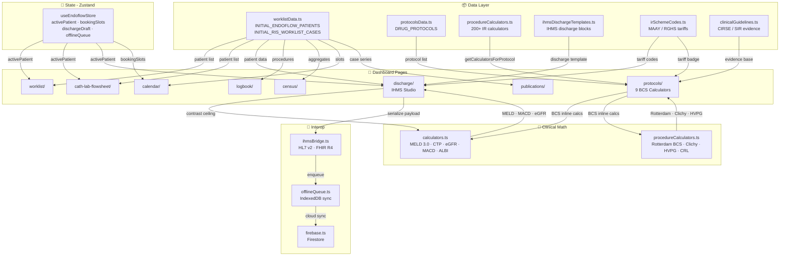

# VascFlow / Vascule OS — Codebase Knowledge Graph

Complete data-flow diagram showing how patient data, protocols, calculators, and interop layers connect across the 29-page clinical suite.

```mermaid
flowchart TD
    subgraph DATA["📦 Data Layer"]
        WD["worklistData.ts<br/>INITIAL_ENDOFLOW_PATIENTS<br/>INITIAL_RIS_WORKLIST_CASES"]
        PD["protocolsData.ts<br/>DRUG_PROTOCOLS"]
        PC["procedureCalculators.ts<br/>200+ IR calculators"]
        DT["ihmsDischargeTemplates.ts<br/>IHMS discharge blocks"]
        IR["irSchemeCodes.ts<br/>MAAY / RGHS tariffs"]
        CG["clinicalGuidelines.ts<br/>CIRSE / SIR evidence"]
    end

    subgraph MATH["🧮 Clinical Math"]
        CA["calculators.ts<br/>MELD 3.0 · CTP · eGFR · MACD · ALBI"]
        PCR["procedureCalculators.ts<br/>Rotterdam BCS · Clichy · HVPG · CRL"]
    end

    subgraph STORE["🔄 State - Zustand"]
        ES["useEndoflowStore<br/>activePatient · bookingSlots<br/>dischargeDraft · offlineQueue"]
    end

    subgraph PAGES["📄 Dashboard Pages"]
        WL["worklist/"]
        CL["cath-lab-flowsheet/"]
        PR["protocols/<br/>9 BCS Calculators"]
        DC["discharge/<br/>IHMS Studio"]
        LB["logbook/"]
        CN["census/"]
        CAL["calendar/"]
        PUB["publications/"]
    end

    subgraph BRIDGE["🔗 Interop"]
        HL7["ihmsBridge.ts<br/>HL7 v2 · FHIR R4"]
        OQ["offlineQueue.ts<br/>IndexedDB sync"]
        FB["firebase.ts<br/>Firestore"]
    end

    WD -->|patient list| WL
    WD -->|patient list| CL
    WD -->|patient data| DC
    WD -->|procedures| LB
    WD -->|aggregates| CN
    WD -->|slots| CAL
    WD -->|case series| PUB

    PD -->|protocol list| PR
    PC -->|getCalculatorsForProtocol| PR
    CA -->|MELD · MACD · eGFR| DC
    PCR -->|Rotterdam · Clichy · HVPG| PR

    DT -->|discharge template| DC
    IR -->|tariff codes| DC
    IR -->|tariff badge| PR

    PR -->|BCS inline calcs| CA
    PR -->|BCS inline calcs| PCR
    DC -->|contrast ceiling| CA

    ES -->|activePatient| WL
    ES -->|activePatient| CL
    ES -->|activePatient| DC
    ES -->|bookingSlots| CAL

    DC -->|serialize payload| HL7
    HL7 -->|enqueue| OQ
    OQ -->|cloud sync| FB

    CG -->|evidence base| PR
```
